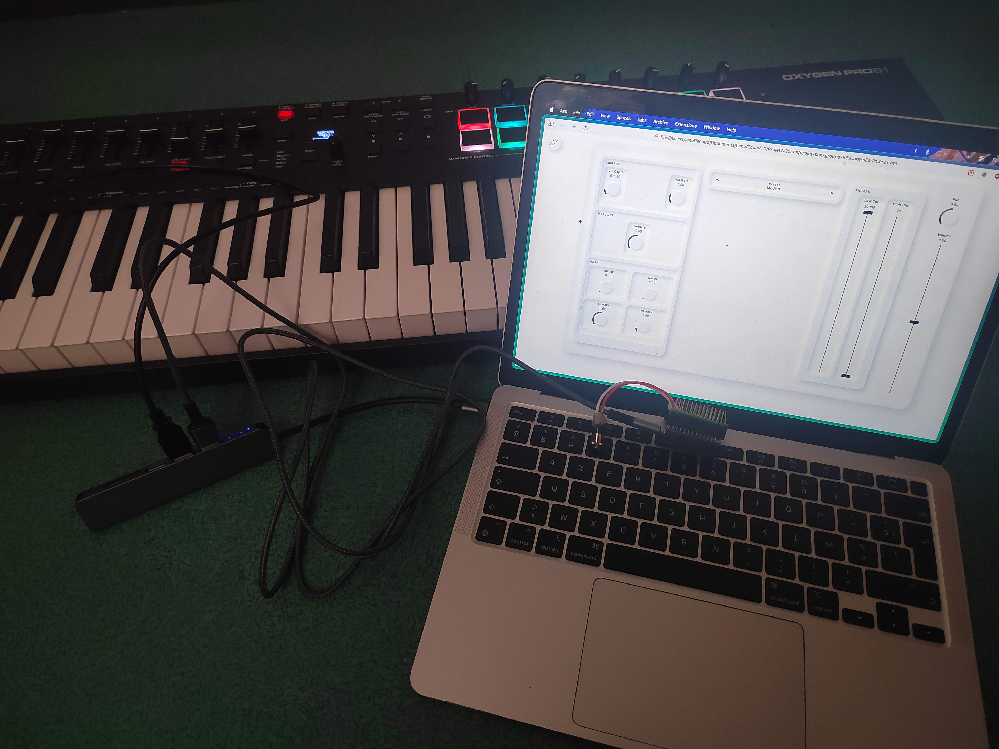
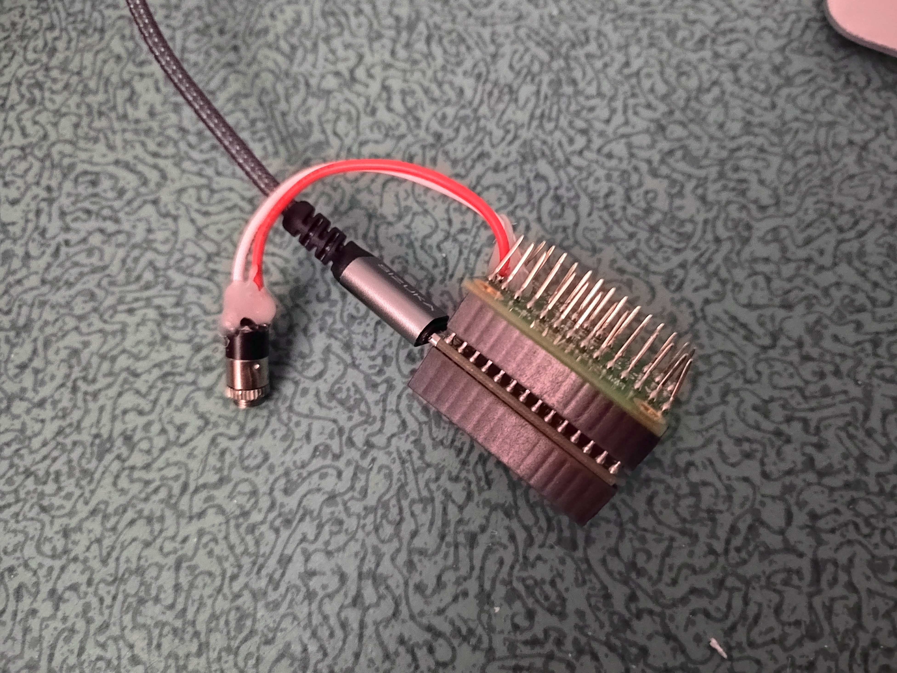

# Sound Project – Teensy Synthesizer Controlled via Web Interface

Real-time sound synthesis project combining:
- an **embedded synthesizer** on Teensy (generated with **FAUST**),
- a **web control interface** (JavaScript) sending parameters through **Serial**,
- **USB MIDI** control for note performance.

---

## 1) Description
### What I built
- Developed an embedded audio chain on **Teensy + Audio Shield**.
- Integrated a **FAUST** synthesis engine (10 presets/instruments).
- Built a web control interface (ADSR, filters, vibrato, panning, volume).
- Implemented real-time **Web Serial → Teensy** parameter exchange.
- Implemented **4-voice polyphony** and **MIDI NoteOn/NoteOff** handling.

### Skills used
- Embedded C/C++ (Arduino/Teensy)
- DSP / audio synthesis (FAUST)
- Front-end JavaScript/HTML/CSS (interactive UI)
- MIDI and serial protocols
- Hardware/software integration

---

## 2) Visual Overview

### Web control interface


### Full project setup


### Teensy board used


---

## 3) Project Architecture

- `Arduino/synth/`: main Teensy firmware (`synth.ino`) + generated FAUST code (`synth.cpp`, `synth.h`)
- `Controller/`: web interface (`index.html`, `app.js`, `styles.css`) + presets (`presets.json`)
- `FAUSTconfigs/`: FAUST sources/configs (including `new_instruments.txt`)
- `Ressources/`: documentation images

Main flow:
1. The browser sends parameters (`attack`, `decay`, `mode`, etc.) through **Serial**.
2. Teensy applies these parameters to the 4 synth voices.
3. Notes are played through **USB MIDI**.
4. Stereo audio output is routed through I2S / SGTL5000.

---

## 4) Setup and Configuration

## 4.1 Hardware requirements
- 1x **Teensy** board compatible with Audio (e.g., Teensy 4.x)
- 1x **Teensy Audio Shield (SGTL5000)**
- USB cable
- Headphones/speakers connected to the Audio Shield
- Optional: **USB MIDI** keyboard or sequencer

## 4.2 Software requirements
- **Arduino IDE**
- **Teensyduino** installed
- Chromium-based browser with **Web Serial** support (Chrome / Edge)
- Python 3 (or any local HTTP server) to serve `Controller/`

## 4.3 Flashing the Teensy firmware
1. Open `Arduino/synth/synth.ino` in Arduino IDE.
2. Select the correct Teensy board.
3. Make sure Teensy Audio libraries are available.
4. Compile and upload to the board.
5. Open Serial Monitor (optional) and check for the `Teensy Ready` message.

## 4.4 Launching the Web interface
From the `Controller/` folder, start a local server:

```bash
cd Controller
python3 -m http.server 8000
```

Then open in your browser:
- `http://localhost:8000`

## 4.5 Connection and usage
1. Click **Connect** in the interface.
2. Select the Teensy serial port.
3. Presets load automatically.
4. Play MIDI notes and adjust parameters in real time.

---

## 5) Controllable Parameters

- **Mode / Preset** (0 to 9)
- **ADSR**: Attack, Decay, Sustain, Release
- **Modulation**: Vibrato Rate, Vibrato Depth
- **Filters**: Low Cut, High Cut
- **Spatialization**: Pan
- **Level**: Volume
- **FX**: Wet/Dry (depending on active implementation)

---

## 6) Notable Technical Points

- 4-voice polyphony with simple voice allocation and replacement when saturated.
- Robust and readable text serial protocol using `param=value` messages.
- FAUST-generated synthesizer integrated into a Teensy Audio architecture.
- Dynamic UI with JSON preset management and synchronized controls.

---

## 7) Possible Improvements

- Add user preset save/load.
- Integrate full DSP-side reverb.
- Add Teensy → interface status feedback (bidirectional communication).
- Extend MIDI handling (CC, pitch bend, aftertouch).

---

## Author

Project completed as part of an academic engineering project (TC) – Group 66.
